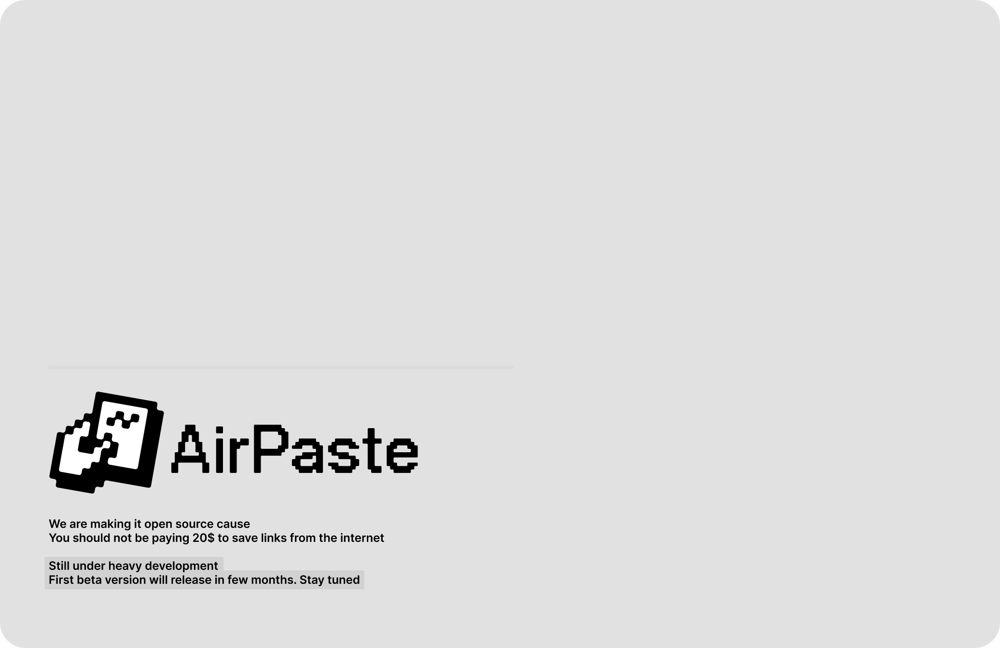
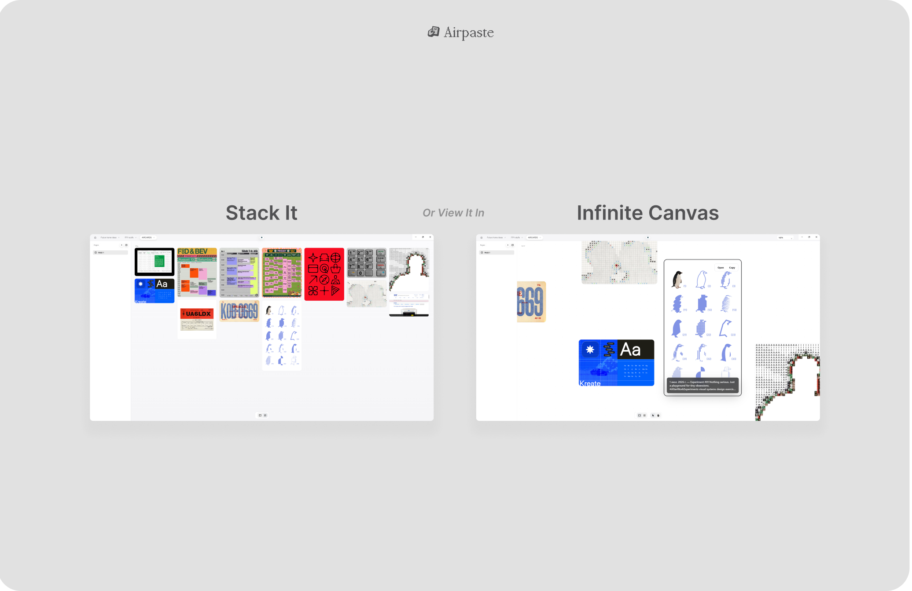
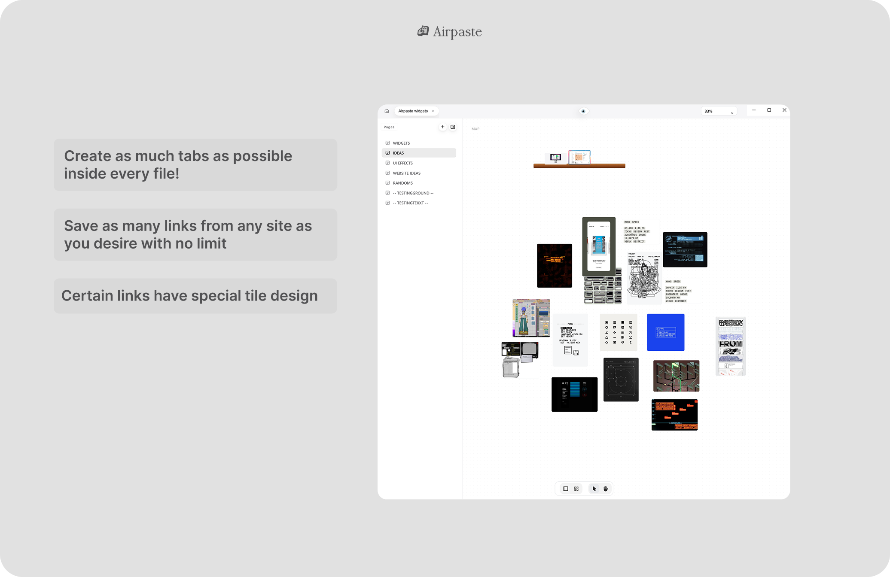

# AirPaste



> A local-first desktop canvas for saving links, text, and images — the way your brain actually works.

**AirPaste** is an open-source Electron app that gives you an infinite canvas workspace to capture anything from your clipboard — URLs with auto-fetched Open Graph previews, images, notes, code snippets, checklists, and more. Everything lives in a single local JSON file. No cloud. No subscription. No \$20/month.

---

## Why I built this

Most "save for later" tools either lock your data in the cloud, charge a subscription, or make it a pain to get things out. AirPaste keeps everything local, in a format you own, with a canvas UI that lets you spatially organise your thoughts the way you actually think.

---

## Features

- **Instant clipboard capture** — paste a URL, image, or text directly onto the canvas
- **Auto Open Graph previews** — links automatically fetch title, description, and cover art
- **Infinite zoom & pan canvas** — built on Konva for smooth, performant 2D rendering
- **Multiple tile types** — links, images, notes, checklists, tables, code snippets, and rack tiles
- **Rich text editing** — notes use Tiptap (ProseMirror) with markdown support
- **Code tiles** — powered by CodeMirror 6 with syntax highlighting
- **Multi-page workspaces** — organise content across named tabs within a single file
- **Drag, resize, group, context menu** — full canvas interaction model
- **Local-first storage** — workspace is a single `data.json` file; atomic writes with backup logic
- **Light / dark theme** — semantic CSS token system, Apple-style greyscale palette
- **Cross-platform** — builds to `.exe` (Windows NSIS), `.dmg` (macOS), and `.AppImage` (Linux)

---





---

## Tech Stack

| Layer | Technology |
|---|---|
| Shell | Electron 37 |
| Renderer | React 19 + Vite 7 |
| Canvas | Konva / react-konva |
| Rich text | Tiptap 3 (ProseMirror) |
| Code editor | CodeMirror 6 |
| UI components | Radix UI primitives |
| Animations | Framer Motion |
| 3D (experimental) | Three.js + React Three Fiber |
| Styling | Tailwind CSS + custom CSS token system |
| Link previews | open-graph-scraper + Electron hidden window screenshot fallback |
| Storage | Local JSON with atomic write + backup |

---

## Getting Started

```bash
# Install dependencies
npm install

# Start in development mode (Vite + Electron, concurrently)
npm run dev

# Build the renderer bundle
npm run build

# Package into a distributable (output in release/)
npm run package
```

> Requires **Node >= 22**

---

## Project Structure

```
AirPaste/
├── main.js                    # Electron main process
├── preload.js                 # Context bridge (IPC)
├── workspace-service.js       # Atomic file read/write logic
├── renderer/
│   └── src/
│       ├── App.jsx            # Root component + canvas HUD
│       ├── design/
│       │   ├── tokens.css     # Base design tokens
│       │   └── theme.css      # Semantic tokens (light/dark)
│       ├── components/        # UI components (tiles, toolbar, shell)
│       ├── context/           # React context providers
│       ├── hooks/             # useCanvas, useTheme, useToast, useLog
│       └── lib/               # Workspace utilities
├── docs/
│   ├── TILE_BOOK.md           # Tile type specifications
│   └── TESTING_TILES.md       # QA rules per tile type
└── build/
    └── logo.png               # App icon
```

---

## Architecture Notes

### Electron ↔ Renderer (IPC)
The main process exposes a minimal set of IPC channels via `preload.js`:

| Channel | Purpose |
|---|---|
| `airpaste:openFolder` | Open workspace folder picker |
| `airpaste:loadWorkspace` | Read `data.json` from disk |
| `airpaste:saveWorkspace` | Atomic write with `.tmp` + rename |
| `airpaste:fetchLinkPreview` | OG scrape + screenshot fallback |

### Canvas model
The canvas is built on **Konva** with a custom `useCanvas` hook managing pointer events, drag, zoom, pan, and selection state. Tiles are rendered as React components inside a `Stage → Layer` tree.

### Design system
A two-layer CSS token system:
- **`tokens.css`** — raw values (font stacks, radii, shadows, spacing)
- **`theme.css`** — semantic aliases mapped to `[data-theme="light"]` / `[data-theme="dark"]`

All component styles consume semantic tokens, never raw values, keeping theming a single-file concern.

### Storage
Workspaces are plain JSON. Writes go through an atomic pattern: write to `.tmp`, then `rename` over the target. A rotating backup is kept to recover from corruption.

---

## Roadmap

- [ ] Shareable workspaces (export / import)
- [ ] In-canvas search across all tiles
- [ ] Plugin tile API
- [ ] Collaborative cursors (local network)

---

## Contributing

This is an active personal project. Issues and PRs are welcome. See [`docs/TILE_BOOK.md`](docs/TILE_BOOK.md) for the tile spec before adding new tile types.

---

## License

ISC — free to use, fork, and build on.